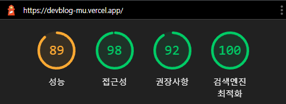

<h1 align="center">Welcome to DEVBLOG 👋</h1>

  
  
  
  
  

> 개발자들의 소통 공간

### 🏠 [DEVBLOG로 이동](https://devblog-mu.vercel.app/)

 

## Lighthouse 성능 측정

 

## 목차

1. [DEVBLOG](#DEVBLOG)
2. [설명](#설명)
3. [주요 사용 기술](#주요-사용-기술)
4. [배포 환경](#배포-환경)
5. [제공 기능](#제공-기능)
6. [파일 관리](#파일-관리)
7. [개발자](#개발자)
8. [제보사항](#제보사항)

 

## DEVBLOG

타게팅 유저는 국내 개발자 분들로, 사는 얘기, 관심사와 기술 개발 등을 게시하여 서로 소통하는 공간을 열어주는 SEO 블로그 서비스 프론트엔드 프로젝트입니다.

 

## 설명

- Next.js를 통해 SSR, SEO, API Routes, font, image optimization 등을 적용
- Material-UI를 통해 웹 UI 전체 페이지 적용(반응형 웹 적용)
- 객체 모델링 도구인 mongoose를 통해 MongoDB 사용(RESTful API 적용)
- cookie와 token을 사용하여 유저 보안 인증
- React-hook-form과 Yup을 통한 유효성 검사 적용
- email verification을 적용하여 무분별한 회원가입 방지
- windowing 기법을 통해 리스트 렌더링

 

## 주요 사용 기술

- React.js
- Next.js
- Mongoose
- Material-ui
- Axios
- JWT
- React Hook Form
- Formidable
- Sendgrid

 

## 배포 환경

- Vercel

 

## 제공 기능

1. 계정 관련

- 로그인
- 로그아웃
- 회원가입
- 비밀번호 찾기
- 계정 설정 변경
- 회원탈퇴

2. 게시글 관련

- 게시글 작성
- 게시글 수정
- 게시글 삭제
- 게시글 관리
- 모든 게시글 관리 (운영자 전용)

3. 북마크 관련

- 북마크 추가
- 북마크 삭제
- 북마크 관리

4. 문의 관련

- 운영자 문의 (이메일 송수신)
- DEVBLOG 사용자 문의 (이메일 송수신)

5. 검색 관련

- 태그 검색
- 게시글 검색(본문, 제목, 소개글 또는 작성자)

 

## 파일 관리

| 파일명     | 목적                      |
| ---------- | ------------------------- |
| actions    | API 호출                  |
| components | DEVBLOG의 UI 컴포넌트     |
| lib        | 커스텀 모듈               |
| models     | mongoose 모델             |
| pages      | 페이지 렌더링 & API Route |
| public     | css images favicon robots |
| view       | Material-UI 연동 모듈     |

 

## 개발자

👤 **Kim DongGyu <po4tion0429@gmail.com>**

- Github: [@po4tion](https://github.com/po4tion)

 

## 제보사항

DEVBLOG 이용시 불편사항/불만사항 또는 오류가 발생했을 시 아래 페이지로 제보 부탁드립니다.  [issues page](https://github.com/po4tion/devblog/issues)
